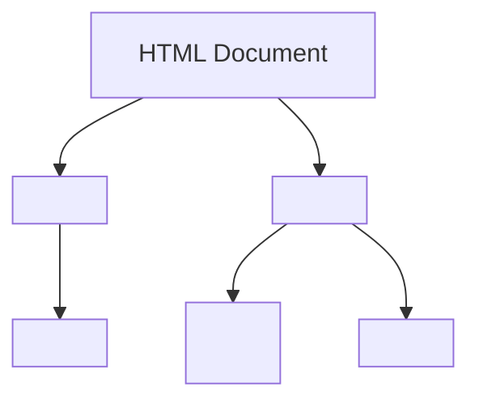

# Smart Exam

A lightweight, self-hosted exam simulator built around the [Smart Exam Format (.sef)](https://github.com/yllemo/Smart-Exam-Format). Drop plain-text question files into a folder, and the app serves them as interactive multiple-choice quizzes — no database, no build step, no dependencies beyond PHP.

## Features

- Dark-themed, mobile-responsive UI
- Single and multiple correct answer support (radio buttons / checkboxes)
- Font size zoom control for comfortable reading on any screen
- "Show Answer" toggle to reveal correct answers mid-exam
- Progress indicator and per-question navigation
- Score summary with clickable per-question results
- Redo incorrect answers to focus on weak spots
- **Full Markdown support** in questions and answers (bold, italic, code, links, images)
- **Mermaid diagram support** — embed flowcharts, sequence diagrams, and more
- **YAML frontmatter support** — add exam metadata (title, description)
- **AI-powered question generator** with OpenAI integration
- URL-based exam loading — share with `?file=` or embed content with `?exam=`
- Password-protected admin panel to create and manage exam files from the browser

## Requirements

- PHP 7.4 or later
- A web server with PHP support (Apache, Nginx) or PHP's built-in server

## Quick Start

```bash
git clone https://github.com/yllemo/Smart-Exam.git
cd Smart-Exam
php -S localhost:8000
```

Open `http://localhost:8000` in your browser. Place `.sef` files in `content/` and they appear on the home screen automatically.

## Project Structure

```
/
├── index.php                  # Exam simulator — lists exams, reads config
├── app.js                     # Exam logic (parsing, navigation, scoring, zoom, AI)
├── style.css                  # Stylesheet (dark theme, responsive)
├── favicon.svg                # Default SVG favicon
├── AI.md                      # SEF format guide for AI integrations
├── .htaccess                  # Security settings (directory listing, config protection)
├── config/
│   ├── config.json            # Site title, favicon, stylesheet, description
│   ├── admin.json_example     # Template for admin credentials (see Admin Panel)
│   ├── ai.json_example        # Template for AI configuration (API keys)
│   └── .htaccess              # Blocks direct access to config files
├── content/
│   ├── *.sef                  # Exam files served on the home screen
│   ├── images/                # Images referenced in exams
│   └── index.html             # Redirect to parent (security)
├── admin/
│   ├── index.php              # Admin panel (login, file list, SEF editor, prompt helper)
│   └── SEF_Exam_Editor.html   # Standalone offline SEF editor (no server required)
├── ai/
│   └── index.php              # AI-powered question generator with OpenAI integration
└── js/
    ├── marked.min.js          # Markdown rendering library
    └── mermaid.min.js         # Mermaid diagram rendering library
```

> **Security Note:** `config/admin.json` and `config/ai.json` are excluded from the repository (see `.gitignore`). 
> They contain sensitive information (password hashes and API keys) and should never be committed to version control.

## Configuration

Edit `config/config.json` to customise the application:

```json
{
  "title": "Smart Exam",
  "favicon": "favicon.svg",
  "stylesheet": "style.css",
  "description": "Interactive exam simulator powered by Smart Exam Format (.sef)"
}
```

| Key | Description |
|-----|-------------|
| `title` | Browser tab title and page heading |
| `favicon` | Path to favicon file — SVG recommended |
| `stylesheet` | Path to CSS stylesheet (swap for custom themes) |
| `description` | Meta description for the page |

## Admin Panel

Visit `/admin/` to manage your exam library. Visit `/ai/` for the AI-powered question generator.

On first visit you are prompted to set an admin password. It is stored as a bcrypt hash in `config/admin.json` (gitignored — never overwritten by deployments).

### Features

| Section | Description |
|---------|-------------|
| **File List** | Browse all `.sef` files with metadata (title, description, question count), size and last-modified date. Edit or delete any file. |
| **Editor** | Split-pane editor with formatting toolbar — Question Builder on the left, raw `.sef` content on the right. Supports frontmatter insertion, comments, Mermaid diagrams, and content normalization. |
| **SEF Format Help** | Comprehensive syntax reference with examples for frontmatter, Markdown, Mermaid diagrams, and advanced features. |
| **Prompt Helper** | Generates ready-to-copy AI prompts for ChatGPT, Claude, Gemini, etc. with full SEF format rules and customizable parameters. |
| **Change Password** | Update the admin password at any time. |

### AI Generator (`/ai/`)

The AI Generator creates new exam questions based on existing results, focusing on topics where students made mistakes.

- **Automatic Analysis**: Analyzes exam results to identify knowledge gaps and misconceptions
- **OpenAI Integration**: Uses GPT-4o or compatible models to generate targeted questions  
- **Smart Formatting**: Outputs properly formatted SEF with frontmatter, Mermaid diagrams, and Markdown
- **Secure**: API keys stored in `config/ai.json` (gitignored), admin authentication required for saving files
- **Flexible**: Customizable question count, language, and additional requirements

## Smart Exam Format

Exam files use the [Smart Exam Format (.sef)](https://github.com/yllemo/Smart-Exam-Format) — a plain-text format for writing multiple-choice questions with modern features.

### Enhanced Syntax

```
---
name: Web Development Quiz
description: HTML, CSS, and JavaScript fundamentals
---

# ── HTML Questions ─────────────────────────────────────────────

Which **tag** creates a hyperlink in HTML?
-* <a>
-  <link>
-  <href>


What does this diagram represent?
-* Basic HTML document structure
-  CSS styling hierarchy
-  JavaScript execution flow

```markdown
Which CSS property controls the **text color**?
```
-* color
-  text-color
-  font-color
```

### New Features

- **YAML Frontmatter**: Add exam metadata (name, description) at the top
- **Comments**: Lines starting with `#` are ignored (use for organization)  
- **Mermaid Diagrams**: Embed flowcharts, sequence diagrams, and more with ` ```mermaid ` blocks
- **Full Markdown**: Bold, italic, code, links, images, lists, and blockquotes in questions
- **Markdown Questions**: Wrap question text in ` ```markdown ` blocks for rich formatting
- **Visual Separators**: Lines starting with `---` create visual sections (ignored by parser)

### Basic Syntax

- Lines prefixed with `-*` are correct answers
- Lines prefixed with `-` are incorrect answers  
- Question blocks are separated by a blank line
- Multiple `-*` lines on one question automatically switch the UI to checkboxes

### Images and links

Images referenced in questions open in a lightbox overlay:

```
What does this chart show? 
-* Monthly revenue trends
-  Employee headcount
```

## URL Parameters

| Parameter | Description | Example |
|-----------|-------------|---------|
| `file` | Load a `.sef` file by server path | `?file=content/myexam.sef` |
| `exam` | Load an exam from base64-encoded SEF text | `?exam=<base64>` |

## Configuration

Edit `config/config.json` to customise the application:

```json
{
  "title": "Smart Exam",
  "favicon": "favicon.svg",
  "stylesheet": "style.css",
  "description": "Interactive exam simulator powered by Smart Exam Format (.sef)"
}
```

| Key | Description |
|-----|-------------|
| `title` | Browser tab title and page heading |
| `favicon` | Path to favicon file — SVG recommended |
| `stylesheet` | Path to CSS stylesheet (swap for custom themes) |
| `description` | Meta description for the page |

### AI Configuration

To enable the AI Generator, create `config/ai.json`:

```json
{
  "api_url": "https://api.openai.com/v1",
  "api_key": "your-openai-api-key",
  "model": "gpt-4o"
}
```

> ⚠️ **Security**: Never commit `config/ai.json` to version control. Use `config/ai.json_example` as a template.

---

## Ideas for Future Development

### Adaptive Learning / Spaced Repetition
Track answer history per question (in `localStorage` or a lightweight backend) and apply a spaced-repetition algorithm. Questions answered correctly multiple times appear less frequently; recently failed questions surface more often — turning the simulator into a genuine study tool.

### Advanced AI Features
- **Multi-language question translation** using AI
- **Difficulty adjustment** based on user performance
- **Question validation** to ensure quality and clarity
- **Bulk question generation** from uploaded documents (PDFs, slides)

### Themes and Accessibility  
- **Light/Dark mode toggle** persisted in `localStorage`
- **High contrast themes** for accessibility
- **Font size persistence** across sessions
- **Screen reader optimization** for visually impaired users

### Collaboration Features
- **Multi-user scoring** and leaderboards
- **Question sharing** between instances
- **Exam templates** and question banks
- **Export to other formats** (PDF, Word, Moodle XML)

### Analytics and Insights
- **Performance analytics** with charts and trends
- **Question difficulty analysis** based on success rates  
- **Learning path recommendations** 
- **Progress tracking** over time

---

## Links

- [Smart Exam Format specification](https://github.com/yllemo/Smart-Exam-Format) — full `.sef` syntax reference, AI integration guide, and examples
